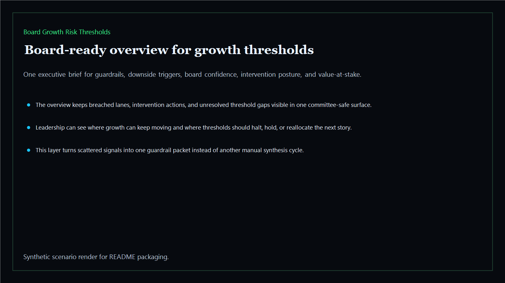
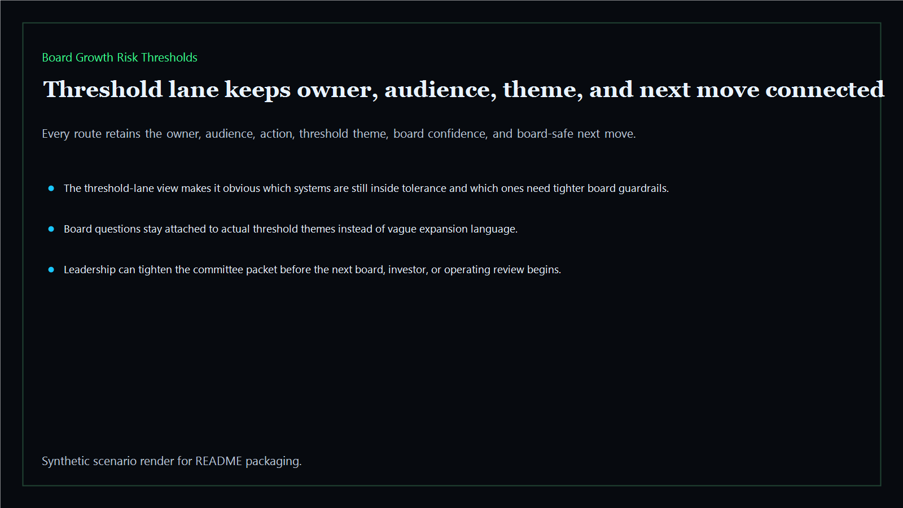
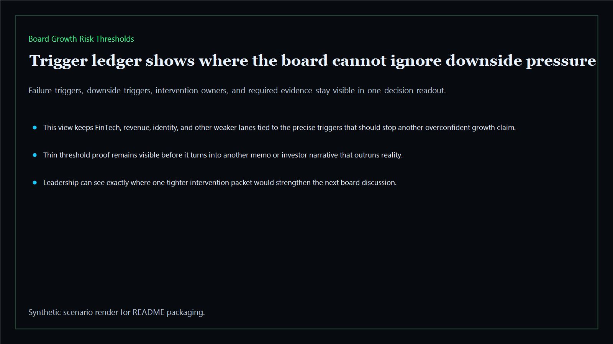
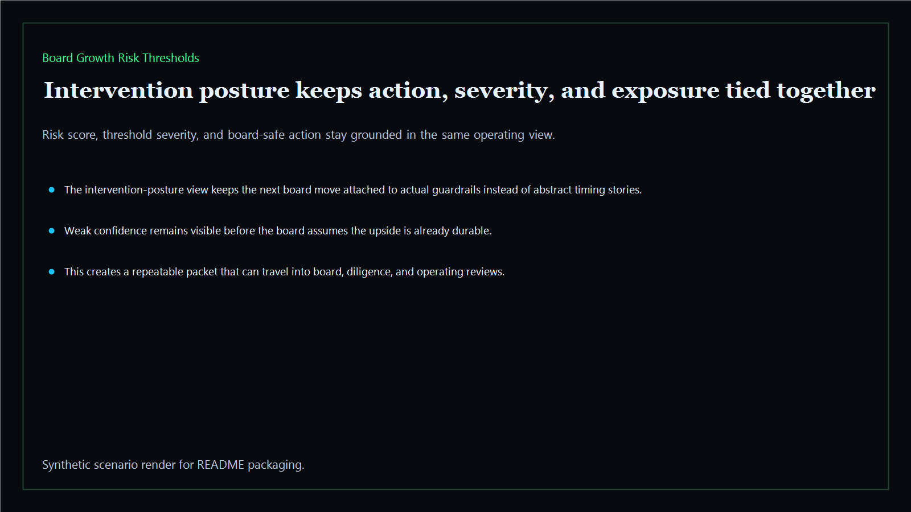

# Board Growth Risk Thresholds

Board-ready growth risk thresholds for pacing guardrails, downside triggers, execution failure signals, and board-safe intervention points across the executive estate.

- Live: `https://thresholds.kineticgain.com/`
- Repo: `mizcausevic-dev/board-growth-risk-thresholds`

## Why this matters

Leaders need more than a growth plan. They need clear threshold lines that show when performance drift, dependency failures, downside pressure, or operating drag should trigger intervention before expansion compounds the problem.

## What it includes

- TypeScript executive-intelligence surface for growth guardrails with modeled trigger thresholds, pacing limits, execution-failure signals, and board-safe intervention posture
- synthetic executive lanes across AI, identity, revenue, FinTech, biotech, procurement, and public-sector readiness
- reusable outputs for threshold briefs, trigger ledgers, intervention packets, and board-ready downside memos
- prerendered static site, JSON payloads, screenshots, and docs

## Routes

- `/`
- `/threshold-lane`
- `/trigger-ledger`
- `/intervention-posture`
- `/verification`
- `/docs`

## Local run

```bash
cd board-growth-risk-thresholds
npm install
npm run verify
npm run prerender
npm run render:assets
```

## CLI

```bash
npx board-growth-risk-thresholds fixtures/board-growth-risk-thresholds.json --format summary
npx board-growth-risk-thresholds fixtures/board-growth-risk-thresholds-clean.json --format json
```

## Docs

- [Architecture](docs/architecture.md)
- [Origin](docs/ORIGIN.md)
- [Kinetic Gain Embedded](docs/KINETIC_GAIN_EMBEDDED.md)

## Screenshots






